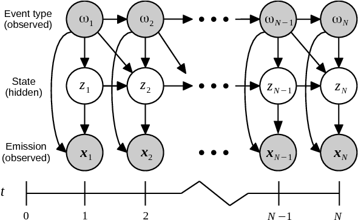

<div align="center">
  <br><br>
</div>

-----------------

[](https://travis-ci.org/vmonaco/pohmm) [](https://pypi.python.org/pypi/pohmm)

# pohmm 

``pohmm`` is an implementation of the partially observable hidden Markov model, a generalization of the hidden Markov model in which the underlying system state is partially observable through event metadata at each time step.

An application that motivates usage of such a model is keystroke biometrics where the user can be in either a passive or active hidden state at each time step, and the time between key presses depends on the hidden state. In addition, the hidden state depends on the key that was pressed; thus the keys are observed symbols that partially reveal the hidden state of the user.

Much of this code is based on the [hmmlearn](https://github.com/hmmlearn/hmmlearn) python package.

## Install

To install the latest stable version:

    $ pip install pohmm

To install the development version:

    $ pip install git+git://github.com/vmonaco/pohmm.git

## Example

Given an observation sequence,

```python
TRAIN_OBS = [4, 3, 4, 2, 3, 1]
```

With partially observed states,

```python
TRAIN_PSTATES = ['b', 'a', 'b', 'a', 'c', 'a']
```

Create and train a model:

```python
model = pohmm.Pohmm(n_hidden_states=2,
                    init_spread=2,
                    emissions=['lognormal'],
                    init_method='obs',
                    smoothing='freq',
                    random_state=1234)

model.fit([np.c_[TRAIN_OBS]], [TRAIN_PSTATES])
```

To view the fitted model parameters,

```python
np.set_printoptions(precision=3)
print(model)

# POHMM
# H-states: 2
# P-states: (3) ['a', 'b', 'c']
# Emission: ['lognormal']
# --------------------------------------------------------------------------------
# Transition probas
# ________________________________________
# . -> .
# [[ 0.5    0.5  ]
#  [ 0.333  0.667]]
# ________________________________________
# a -> .
# [[  5.000e-01   5.000e-01]
#  [  1.000e-05   1.000e+00]]
# ________________________________________
# . -> a
# [[ 0.5  0.5]
#  [ 0.5  0.5]]
# ________________________________________
# b -> .
# [[  5.000e-01   5.000e-01]
#  [  5.000e-06   1.000e+00]]
# ________________________________________
# . -> b
# [[  5.000e-01   5.000e-01]
#  [  1.000e-05   1.000e+00]]
# ________________________________________
# c -> .
# [[  5.000e-01   5.000e-01]
#  [  1.000e+00   1.000e-05]]
# ________________________________________
# . -> c
# [[  5.000e-01   5.000e-01]
#  [  1.000e-05   1.000e+00]]
# ________________________________________
# a -> a
# [[ 0.5    0.5  ]
#  [ 0.375  0.625]]
# ________________________________________
# a -> b
# [[  5.000e-01   5.000e-01]
#  [  1.000e-05   1.000e+00]]
# ________________________________________
# a -> c
# [[  5.000e-01   5.000e-01]
#  [  1.000e-05   1.000e+00]]
# ________________________________________
# b -> a
# [[ 0.5  0.5]
#  [ 0.1  0.9]]
# ________________________________________
# b -> b
# [[ 0.5    0.5  ]
#  [ 0.083  0.917]]
# ________________________________________
# b -> c
# [[ 0.5    0.5  ]
#  [ 0.083  0.917]]
# ________________________________________
# c -> a
# [[ 0.5    0.5  ]
#  [ 0.833  0.167]]
# ________________________________________
# c -> b
# [[ 0.5  0.5]
#  [ 0.5  0.5]]
# ________________________________________
# c -> c
# [[ 0.5  0.5]
#  [ 0.5  0.5]]
# --------------------------------------------------------------------------------
# Starting probas
# .: [  1.000e-05   1.000e+00]
# a: [  1.000e-05   1.000e+00]
# b: [  1.000e-05   1.000e+00]
# c: [  1.000e-05   1.000e+00]
# --------------------------------------------------------------------------------
# Steady probas
# .: [ 0.375  0.625]
# a: [ 0.5  0.5]
# b: [ 0.25  0.75]
# c: [ 0.25  0.75]
# --------------------------------------------------------------------------------
# Emissions
# ________________________________________
# Feature 0: lognormal
# .: logmu = [  1.116e-05   1.093e+00]
# a: logmu = [  4.367e-06   9.452e-01]
# b: logmu = [  2.151e-05   1.289e+00]
# c: logmu = [  9.213e-06   1.096e+00]
# .: logsigma = [ 0.004  0.262]
# a: logsigma = [ 0.002  0.218]
# b: logsigma = [ 0.005  0.087]
# c: logsigma = [ 0.003  0.131]
# --------------------------------------------------------------------------------
```

And obtain the loglikelihood of a test sequence:

```python
TEST_OBS = [2, 1, 6]
TEST_PSTATES = ['c', 'a', 'd']
print(model.score(np.c_[TEST_OBS], TEST_PSTATES))

# -4.81378034867
```

Finally, use the model to generate data:

```python
sample_obs, sample_pstates, sample_hstates = model.sample(n_obs=10, random_state=1234)
print('Observations:\n', sample_obs)
print('partial states:\n', sample_pstates)
print('hidden states:\n', sample_hstates)

# Observations:
# [[ 4.321]
#  [ 2.579]
#  [ 3.674]
#  [ 1.006]
#  [ 2.875]
#  [ 1.002]
#  [ 1.003]
#  [ 2.473]
#  [ 2.744]
#  [ 1.002]]
# p-states: 
#  ['b' 'a' 'b' 'a' 'c' 'a' 'b' 'a' 'c' 'a']
# h-states: 
#  [1 1 1 0 1 0 0 1 1 0]
```

Other examples can be found in the `examples/` directory. To obtain results for che [CMU Keystroke dataset](http://www.cs.cmu.edu/~keystroke/), run

    $ python examples/keystroke.py

## How to cite

```
@article{monaco2016pohmm,
  title={The Partially Observable Hidden Markov Model with Application to Keystroke Biometrics},
  author={John V.~Monaco and Charles C.~Tappert},
  journal={arXiv preprint arXiv:1607.03854},
  year={2016}
}

```